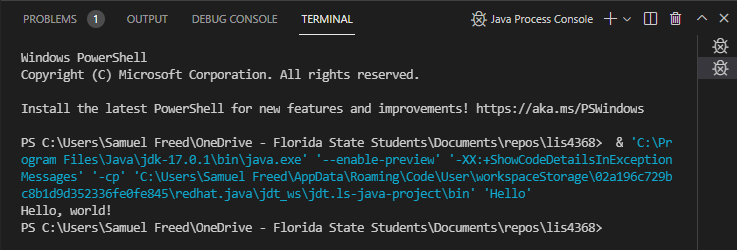
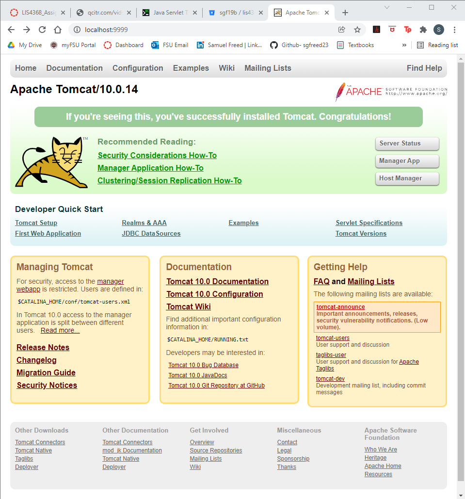
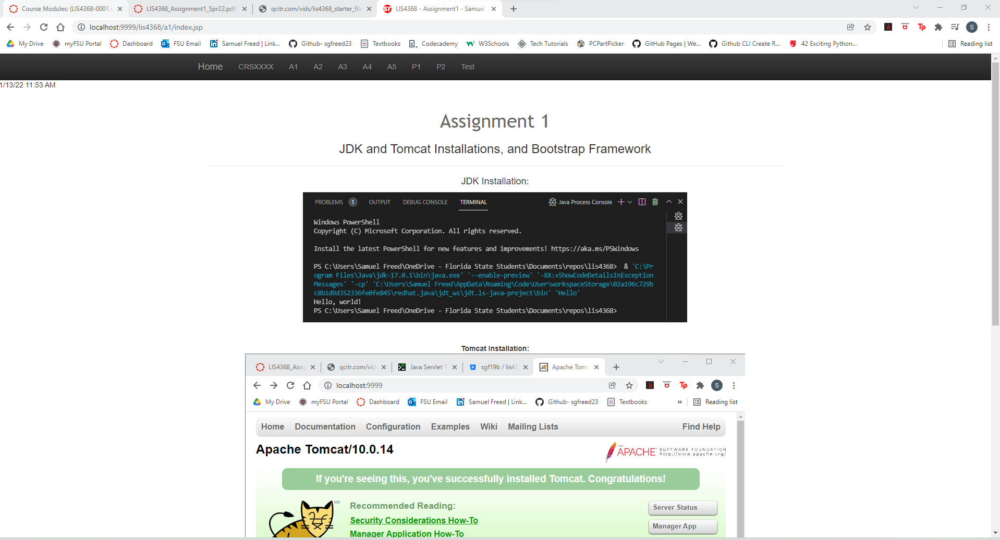

> **NOTE:** This README.md file should be placed at the **root of each of your repos directories.**
>
>Also, this file **must** use Markdown syntax, and provide project documentation as per below--otherwise, points **will** be deducted.
>

# LIS4368

## Samuel Freed

### Assignment 1 Requirements:

*Three Parts:*

1. Distriuted Version Control with Git and Bitbucket
2. Java/JSP/Servlet Development Installation
3. Chapter Questions (Chapters 1 - 4)

#### README.md file should include the following items:

* Screenshot of running Java Hello (#1 Above)
* Screenshot of running http://locahost9999 (#2 above Step #4(b) in tutorial
* Git commands w/short descriptions
* Bitbucket repo links a) this assignment and b) the completed tutorial above (bitbucketstationlocations)

> This is a blockquote.
> 
> This is the second paragraph in the blockquote.
>
> #### Git commands w/short descriptions:

1. git init - Create empty Git repo in specified directory.
2. git status - List which files are staged, unstaged, and untracked.
3. git add - adds a change in the working directory to the staging area.
4. git commit - captures a snapshot of the project's currently staged changes.
5. git push - used to upload local repository content to a remote repository.
6. git pull - Fetch the specified remote’s copy of current branch and
immediately merge it into the local copy
7. git clone - Clone repo located at <repo> onto local machine. Original repo can be
located on the local filesystem or on a remote machine via HTTP or SSH.

#### Assignment Screenshots:

*Screenshot of running java Hello*:

*Screenshot of Tomcat*:

*Screenshot of a1/index.jsp*:

#### Tutorial Links:

*Bitbucket Tutorial - Station Locations:*
[A1 Bitbucket Station Locations Tutorial Link](https://bitbucket.org/username/bitbucketstationlocations/ "Bitbucket Station Locations")

*Tutorial: Request to update a teammate's repository:*
[A1 My Team Quotes Tutorial Link](https://bitbucket.org/username/myteamquotes/ "My Team Quotes Tutorial")