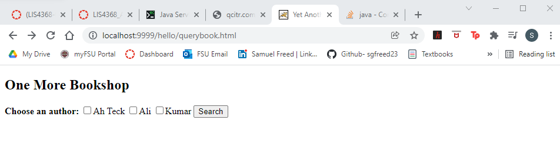
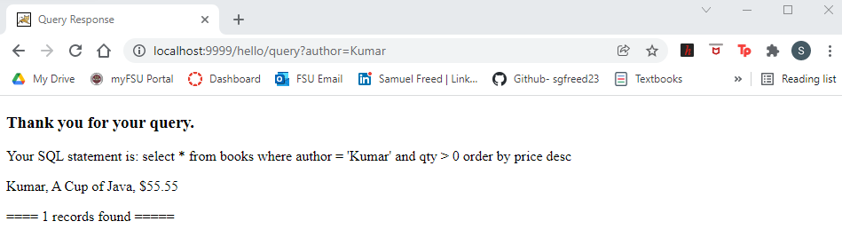
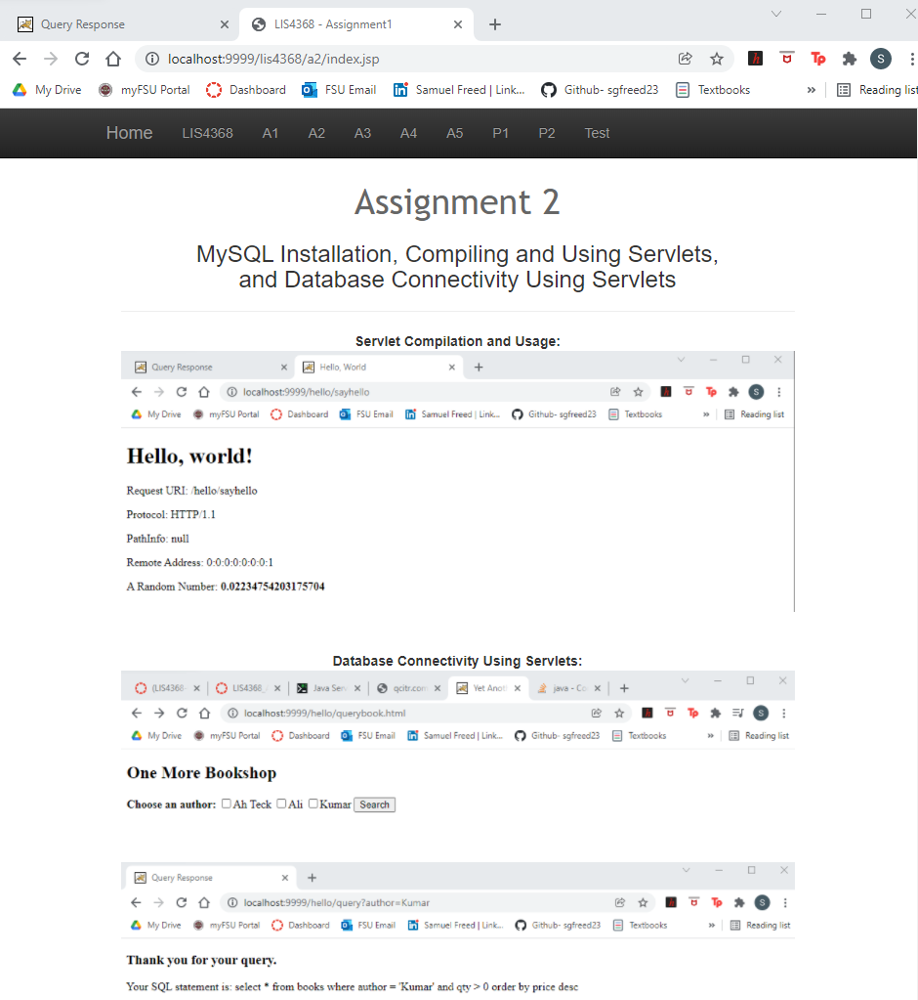
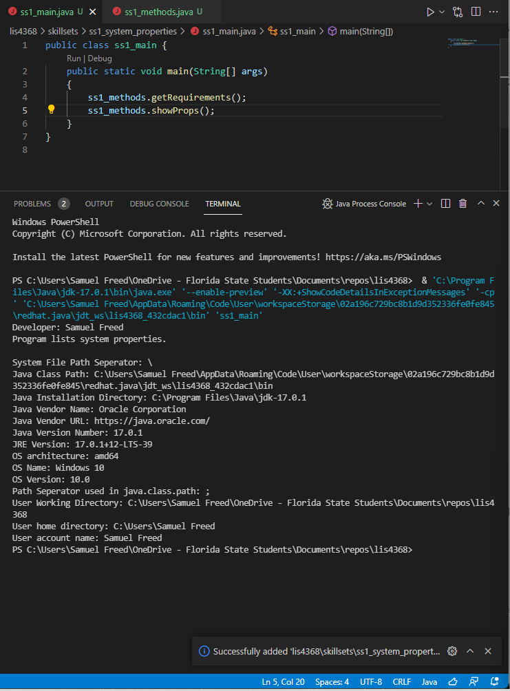
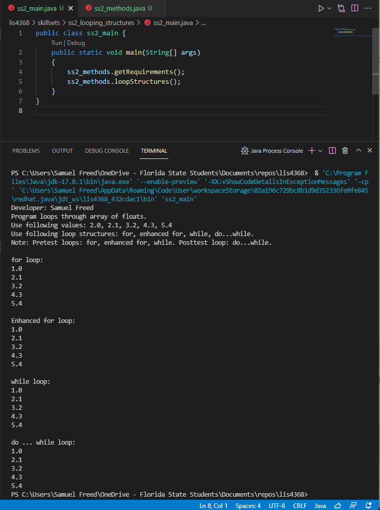
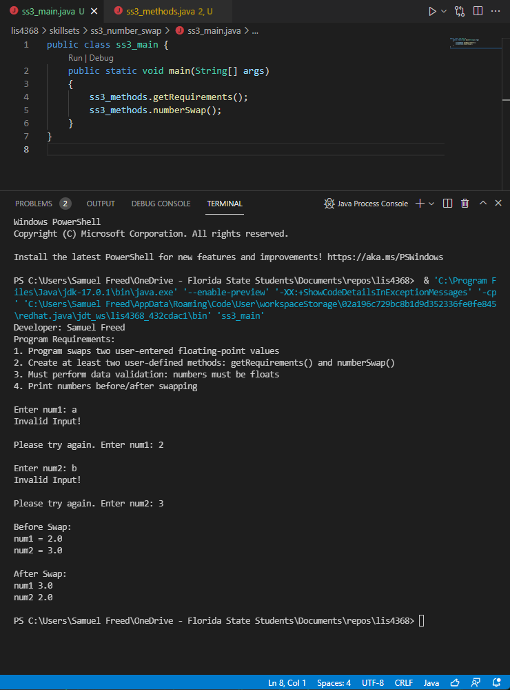

> **NOTE:** This README.md file should be placed at the **root of each of your repos directories.**
>
>Also, this file **must** use Markdown syntax, and provide project documentation as per below--otherwise, points **will** be deducted.
>

# LIS4368

## Samuel Freed

### Assignment 2 Requirements:

*Three Parts:*

1. Install MySQL workbench
2. Create a Java Servlet
3. Provide Screenshots of Development
4. Provide Screenshots of SkillSets
5. Chapter Questions (Chapters 5 - 6)

#### README.md file should include the following items:

* Screenshot of running Java Hello (#1 Above)
* Screenshot of running http://locahost9999 (#2 above Step #4(b) in tutorial
* Git commands w/short descriptions
* Bitbucket repo links a) this assignment and b) the completed tutorial above (bitbucketstationlocations)

> This is a blockquote.
> 
> This is the second paragraph in the blockquote.
>

#### Assignment Screenshots:

*Screenshot of Querybook*:

*Screenshot of Query Results*:

*Screenshot of a2/index.jsp*:

#### SkillSet Screenshots:

*Screenshot ss1: System Properties running:

*Screenshot of ss2: Looping Structures running:

*Screenshot of ss3:	Number Swap running:

#### Tutorial Links:

*Bitbucket Tutorial - Station Locations:*
[A1 Bitbucket Station Locations Tutorial Link](https://bitbucket.org/username/bitbucketstationlocations/ "Bitbucket Station Locations")

*Tutorial: Request to update a teammate's repository:*
[A1 My Team Quotes Tutorial Link](https://bitbucket.org/username/myteamquotes/ "My Team Quotes Tutorial")