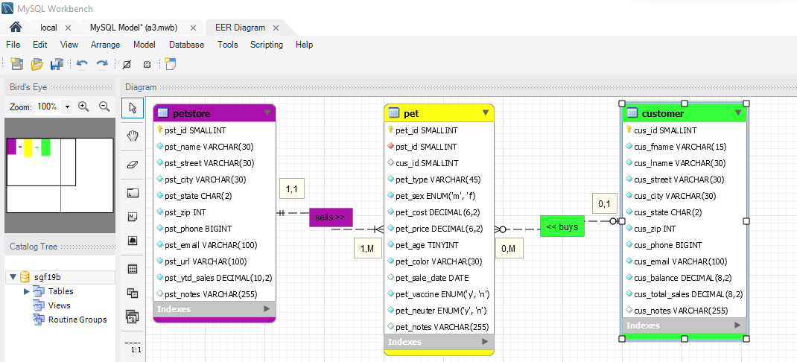
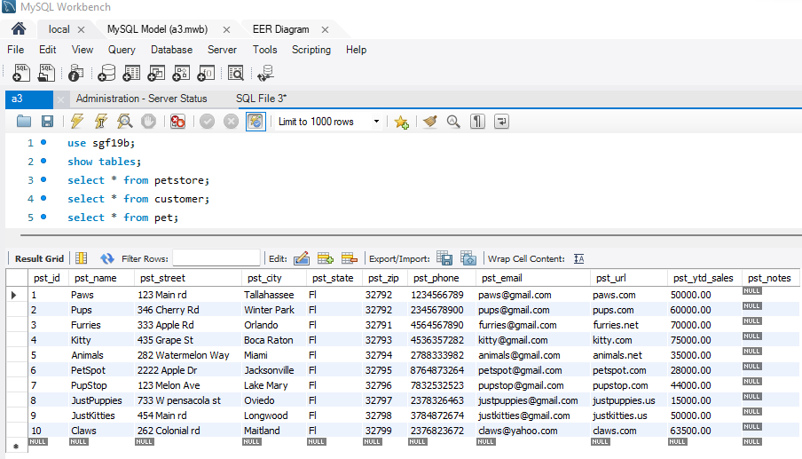
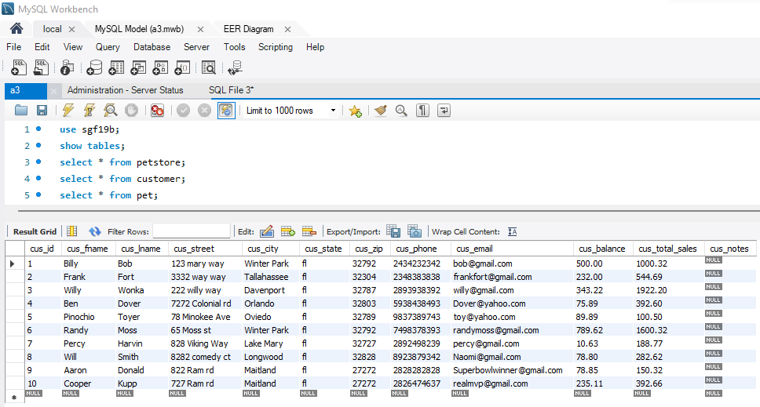
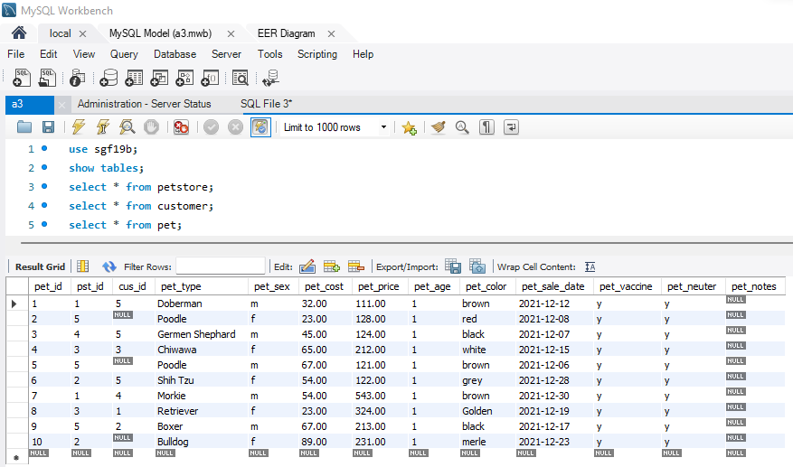
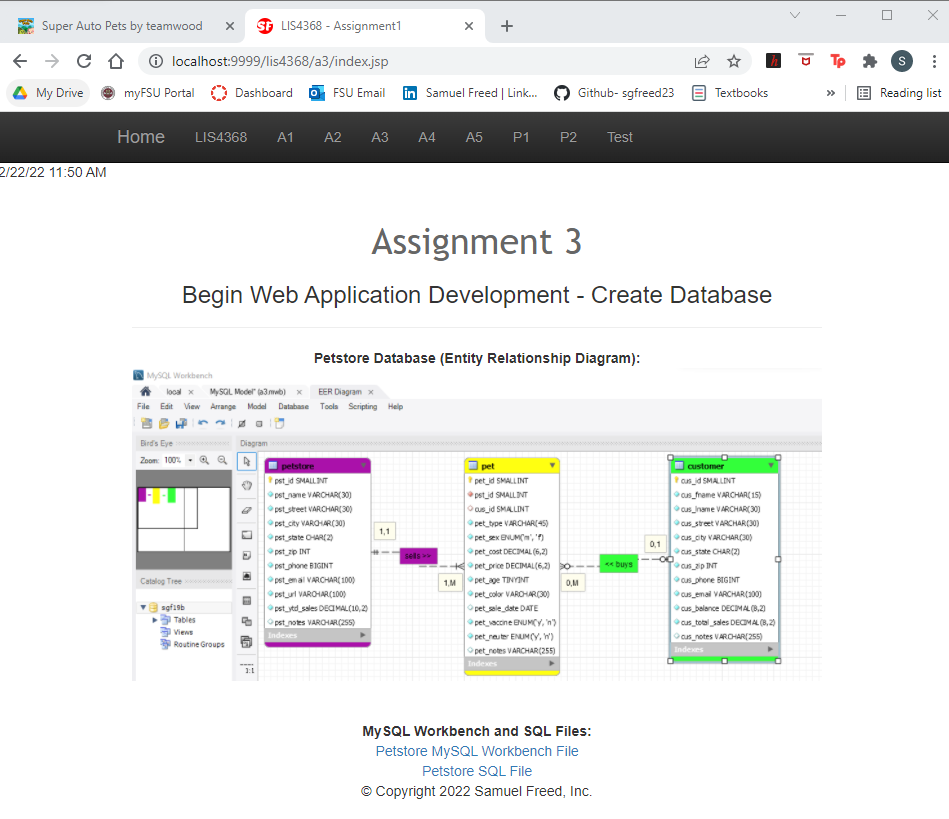
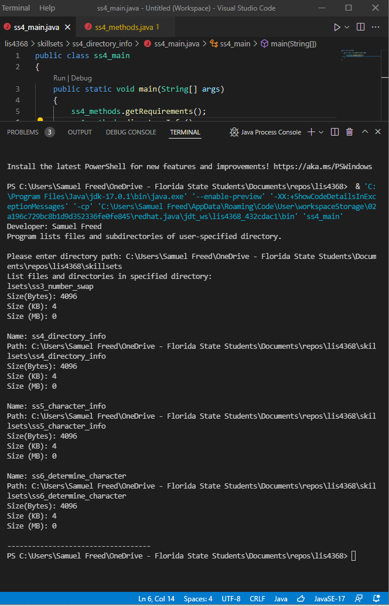
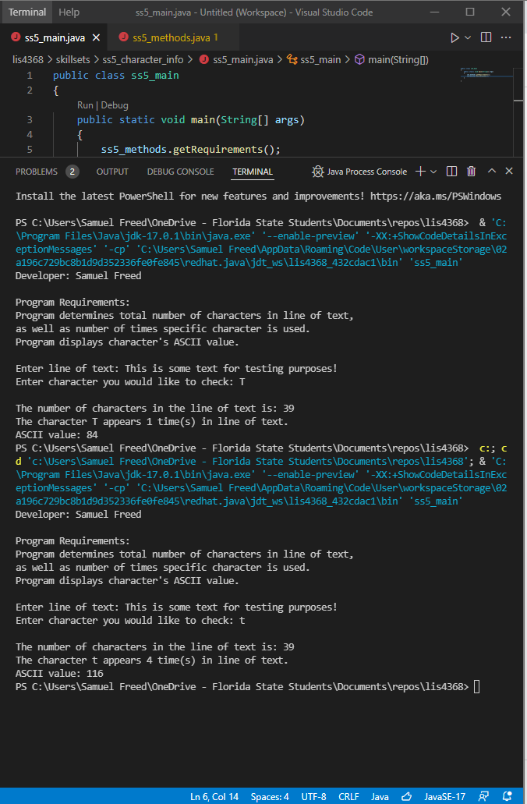
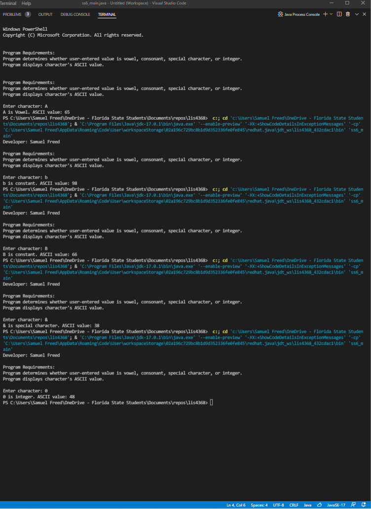

> **NOTE:** This README.md file should be placed at the **root of each of your repos directories.**
>
>Also, this file **must** use Markdown syntax, and provide project documentation as per below--otherwise, points **will** be deducted.
>

# LIS4368 Advanced Web App Development

## Samuel Freed

### Assignment 3 Requirements:

*Three Parts:*

1. Create Databse with ERD 
2. Forward Engineer locally with 10 "unique" records per table
3. Provide Screenshots of ERD and a3/index.jsp
4. Provide links of a3.mwb and a3.sql
5. Provide Screenshots of SkillSets

#### README.md file should include the following items:

> This is a blockquote.
> 
> This is the second paragraph in the blockquote.
>

#### Assignment Screenshots:

*Screenshot of ERD*:

*Screenshot of Query Results running:

*Screenshot of Query Results running:

*Screenshot of Query Results running:

*Screenshot of a3/index.jsp*:

#### Assignment Links:

*A3 docs: a3.mwb and a3.sql*: 
 
[A3 MWB File](docs/a3.mwb "A3 ERD in .mwb format") 
 
[A3 SQL File](docs/a3.sql "A3 SQL Script") 

#### SkillSet Screenshots:

*Screenshot ss4: Directory Info:

*Screenshot of ss5: Character Info:

*Screenshot of ss6:	Determine Character:

#### Tutorial Links:

*Bitbucket Tutorial - Station Locations:*
[A1 Bitbucket Station Locations Tutorial Link](https://bitbucket.org/username/bitbucketstationlocations/ "Bitbucket Station Locations")

*Tutorial: Request to update a teammate's repository:*
[A1 My Team Quotes Tutorial Link](https://bitbucket.org/username/myteamquotes/ "My Team Quotes Tutorial")