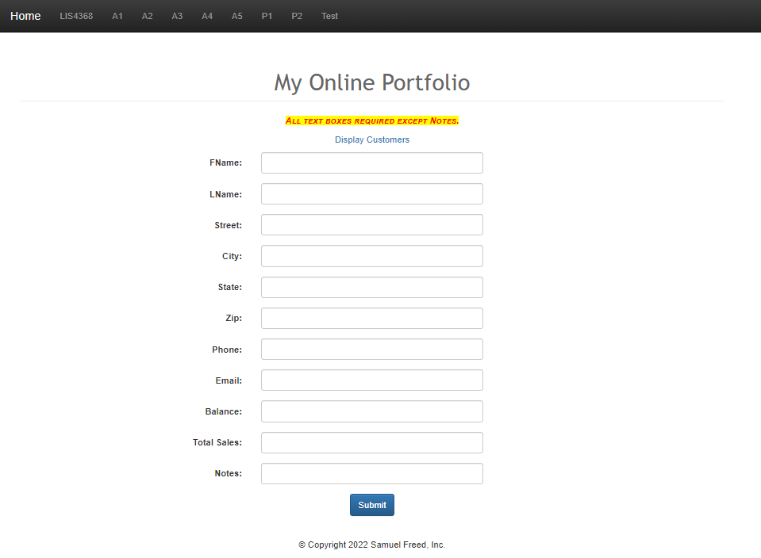
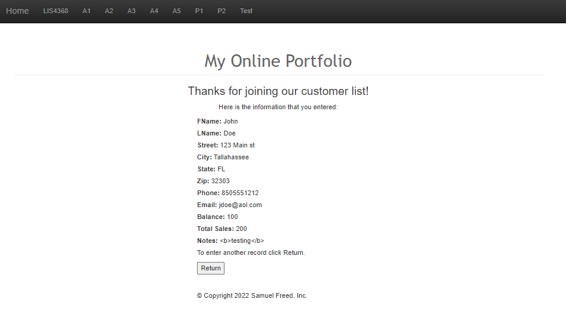
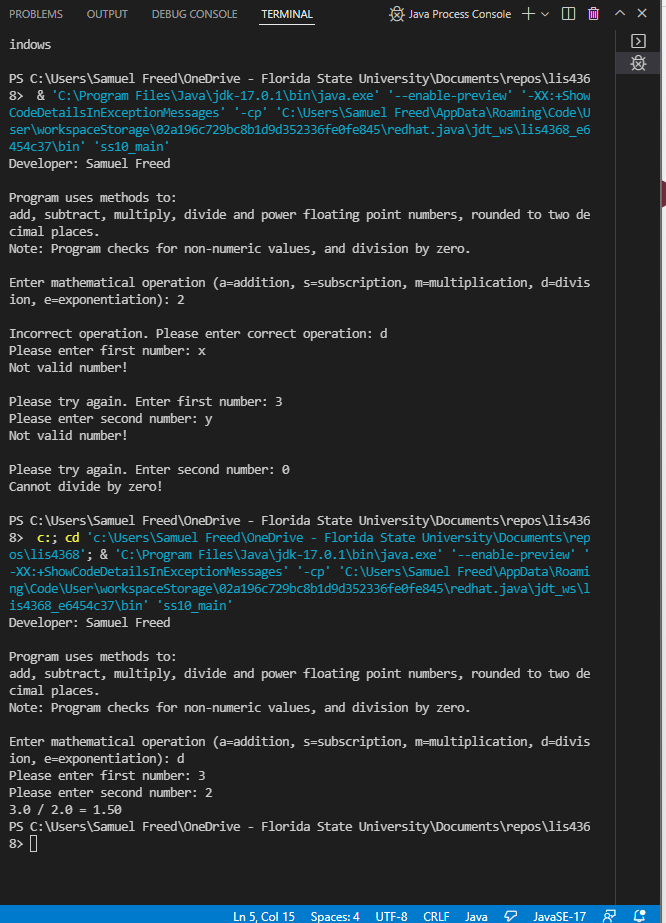
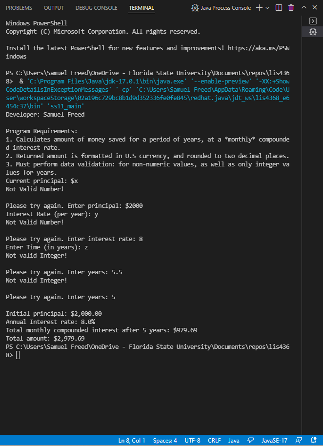
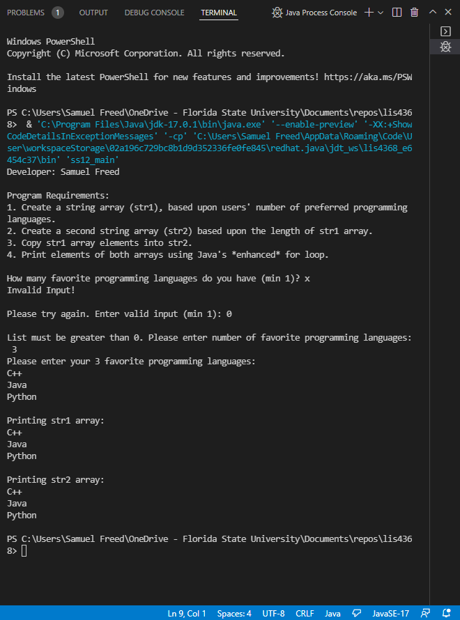

> **NOTE:** This README.md file should be placed at the **root of each of your repos directories.**
>
>Also, this file **must** use Markdown syntax, and provide project documentation as per below--otherwise, points **will** be deducted.
>

# LIS4368 Advanced Web App Development

## Samuel Freed

### Assignment 4 Requirements:

*Three Parts:*

1. Provide failed data validation
2. Provide passed data validation
3. Compile servlet files
4. Provide Screenshots of SkillSets

#### README.md file should include the following items:

> This is a blockquote.
> 
> This is the second paragraph in the blockquote.
>

#### Assignment Screenshots:

### Assignment Screenshots:
|Validation Failed| Validation Passed|
|----|----|
|||

#### SkillSet Screenshots:

| SS10 | SS11 | SS12 |
| ----------- | ----------- | ----------- |
||||

#### Tutorial Links:

*Bitbucket Tutorial - Station Locations:*
[A1 Bitbucket Station Locations Tutorial Link](https://bitbucket.org/username/bitbucketstationlocations/ "Bitbucket Station Locations")

*Tutorial: Request to update a teammate's repository:*
[A1 My Team Quotes Tutorial Link](https://bitbucket.org/username/myteamquotes/ "My Team Quotes Tutorial")