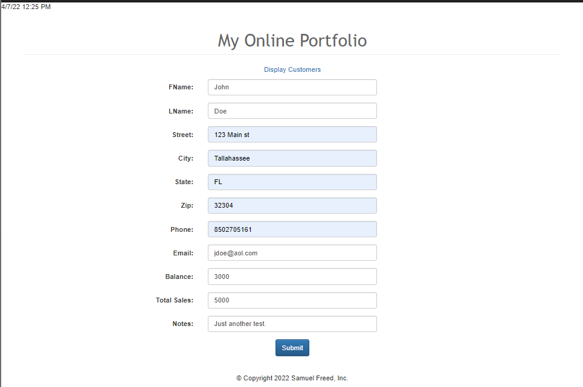
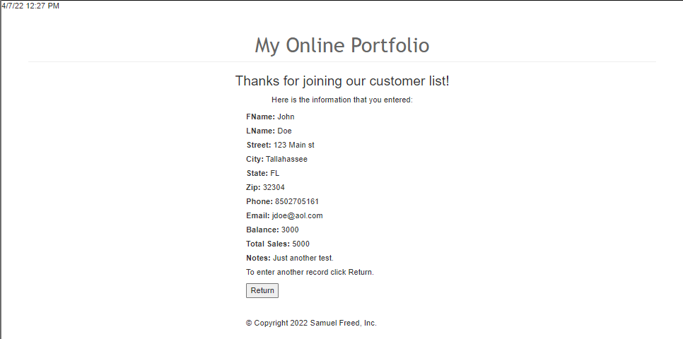
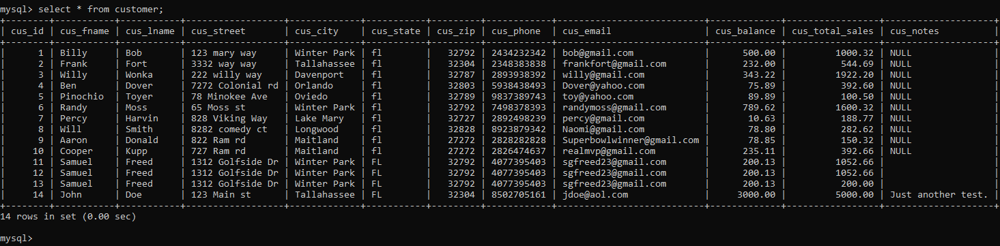
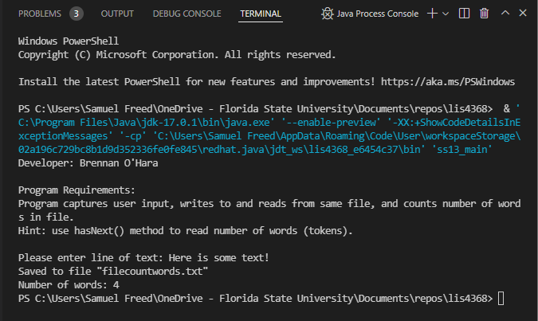
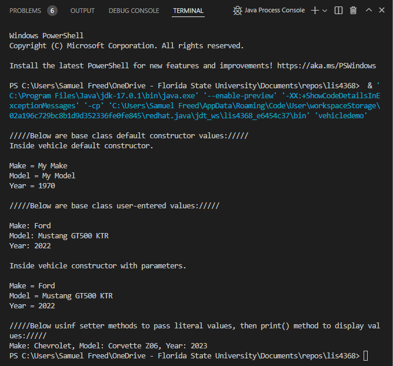
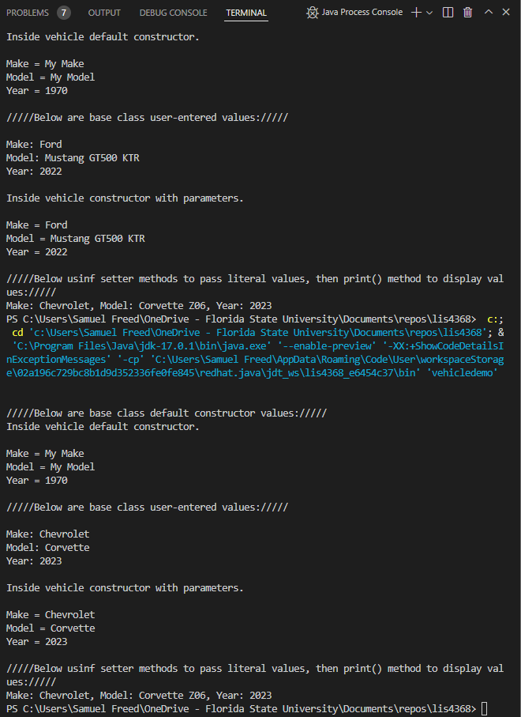

> **NOTE:** This README.md file should be placed at the **root of each of your repos directories.**
>
>Also, this file **must** use Markdown syntax, and provide project documentation as per below--otherwise, points **will** be deducted.
>

# LIS4368 Advanced Web App Development

## Samuel Freed

### Assignment 5 Requirements:

*Four Parts:*

1. Create and file new data CRUD subdirectory
2. Modify and compile servlet files
3. Demonstrate Use of Server Side validation with SQL insertion
4. Provide Screenshots of SkillSets 13-15

#### README.md file should include the following items:

> This is a blockquote.
> 
> This is the second paragraph in the blockquote.
>

### Assignment Screenshots:

*Screenshots of Pre and Post Validation*

|Pre Valid User Form Entry| Post Valid User Form Entry|
|----|----|
|||

*Screenshot of SQL Insertion*

#### SkillSet Screenshots:

| SS13 | SS14 | SS15 |
| ----------- | ----------- | ----------- |
||||

#### Tutorial Links:

*Bitbucket Tutorial - Station Locations:*
[A1 Bitbucket Station Locations Tutorial Link](https://bitbucket.org/username/bitbucketstationlocations/ "Bitbucket Station Locations")

*Tutorial: Request to update a teammate's repository:*
[A1 My Team Quotes Tutorial Link](https://bitbucket.org/username/myteamquotes/ "My Team Quotes Tutorial")