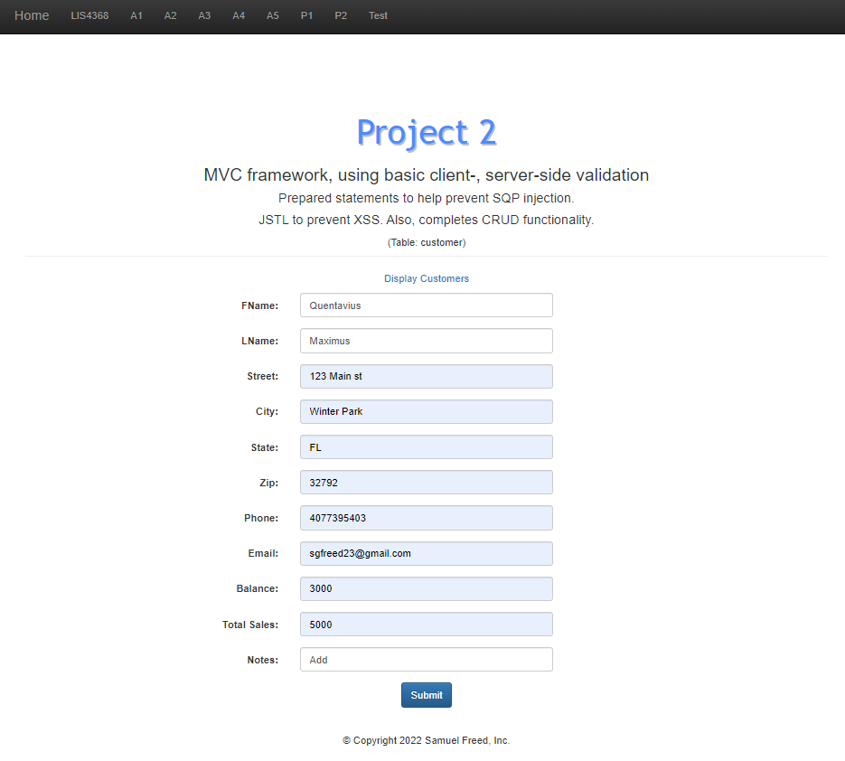
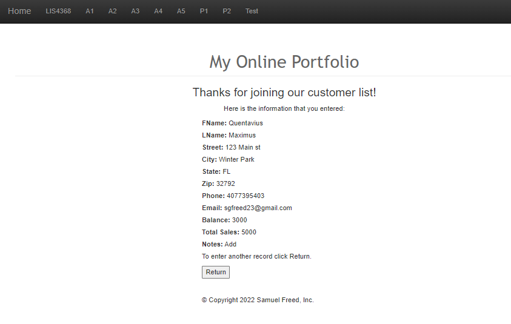
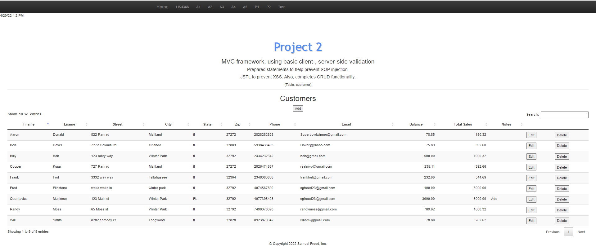
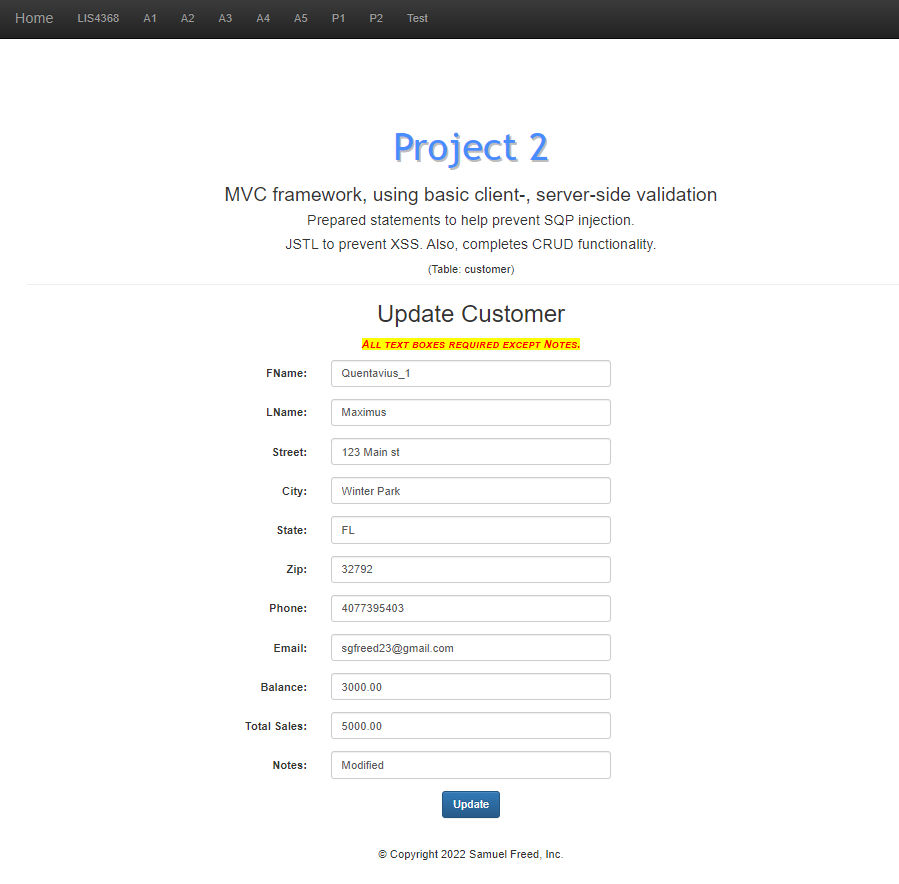
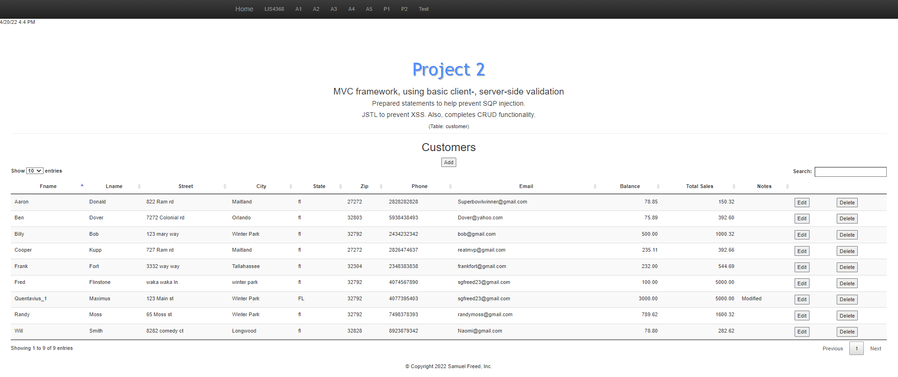
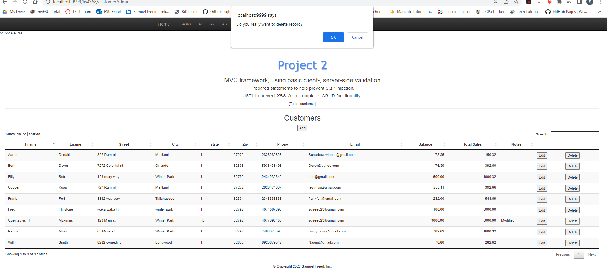
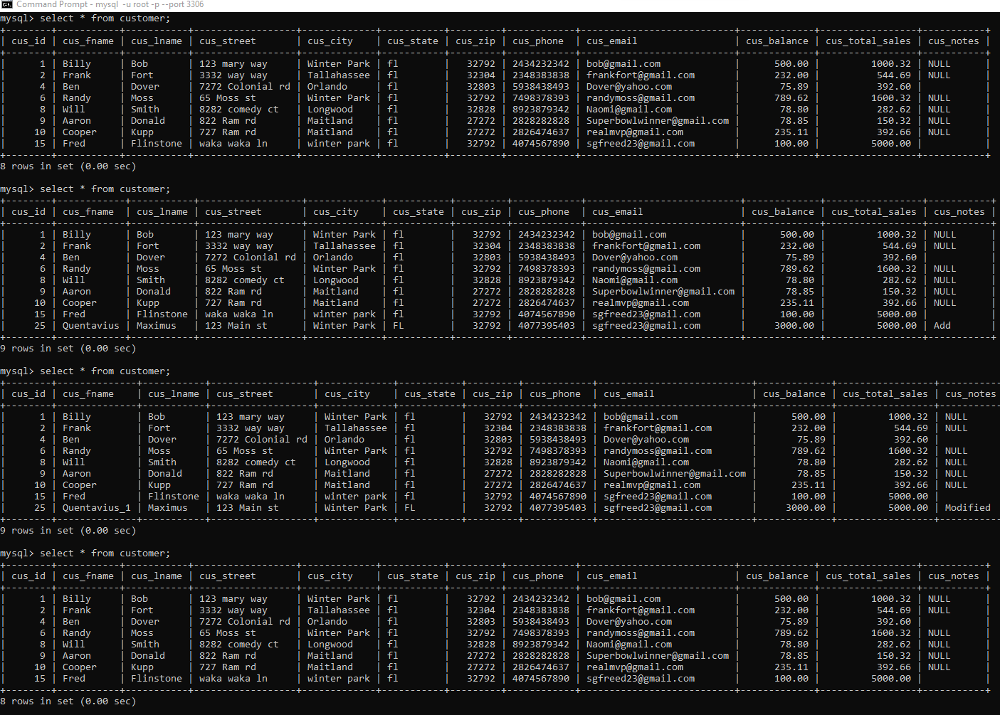

> **NOTE:** This README.md file should be placed at the **root of each of your repos directories.**
>
>Also, this file **must** use Markdown syntax, and provide project documentation as per below--otherwise, points **will** be deducted.
>

# LIS4368 Advanced Web App Development

## Samuel Freed

### Project 2 Requirements:

*Four Parts:*

1. Implement update, delete, add functionality
2. Integrate prepared statements to help prevent sql injection
3. Provide screenshots of table, pre and post command
4. Include server and client side validation 

#### README.md file should include the following items:

> This is a blockquote.
> 
> This is the second paragraph in the blockquote.
>

### Project Screenshots:

*Screenshots of Pre and Post Validation*

|Pre Valid User Form Entry| Post Valid User Form Entry|
|----|----|
|||

*Screenshot of Display Data*

*Screenshots of Pre and Post Validation*

| Modified Form | Modified Data |
|----|----|
|||

*Screenshots of Pre and Post Validation*

| Delete Prompt | Database Changes |
|----|----|
|||

#### Tutorial Links:

*Bitbucket Tutorial - Station Locations:*
[A1 Bitbucket Station Locations Tutorial Link](https://bitbucket.org/username/bitbucketstationlocations/ "Bitbucket Station Locations")

*Tutorial: Request to update a teammate's repository:*
[A1 My Team Quotes Tutorial Link](https://bitbucket.org/username/myteamquotes/ "My Team Quotes Tutorial")