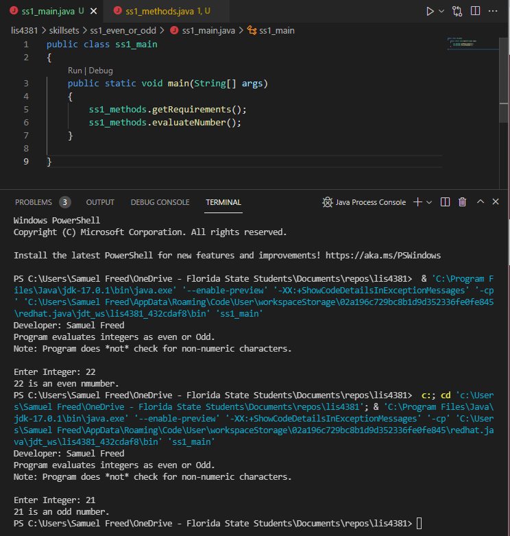
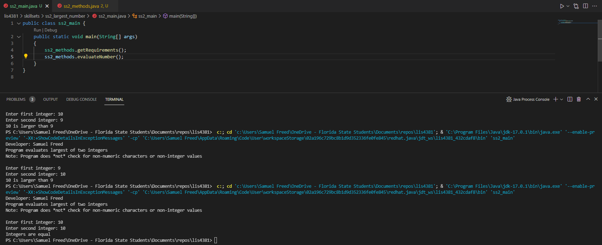
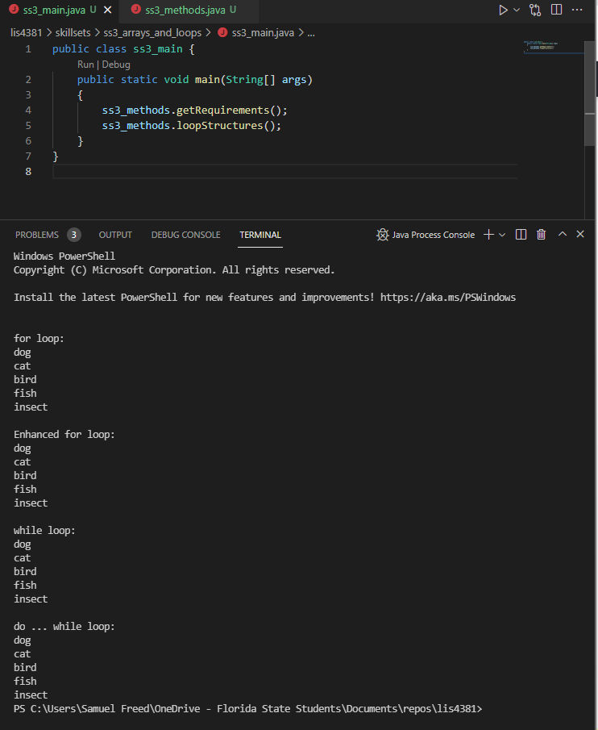

> **NOTE:** This README.md file should be placed at the **root of each of your repos directories.**
>
>Also, this file **must** use Markdown syntax, and provide project documentation as per below--otherwise, points **will** be deducted.
>

# LIS 4381 Mobile Web App Develeopment

## Samuel Freed

### Assignment 2 Requirements:

*Four Parts:*

1. Ceate a mobile recipe app using Android Studio
2. Screenshots of Android Studio Development
3. Screenshots of Running Skillsets
4. Chapter Questions (Chs 3 - 4)

#### README.md file should include the following items:

*Course title, your name, assignment requirements, as per A1; 
*Screenshot of running application’s first user interface; 
*Screenshot of running application’s second user interface; 

#### Assignment Screenshots:

| First User Interface | Second User Interface |
| ----------- | ----------- |
|||

#### SkillSet Screenshots:

| SS1 | SS2 | SS3 |
| ----------- | ----------- | ----------- |
||||

#### Tutorial Links:

*Bitbucket Tutorial - Station Locations:*
[A1 Bitbucket Station Locations Tutorial Link](https://bitbucket.org/sgf19b/bitbucketstationlocations/ "Bitbucket Station Locations")

*Tutorial: Request to update a teammate's repository:*
[A1 My Team Quotes Tutorial Link](https://bitbucket.org/sgf19b/myteamquotes/ "My Team Quotes Tutorial")