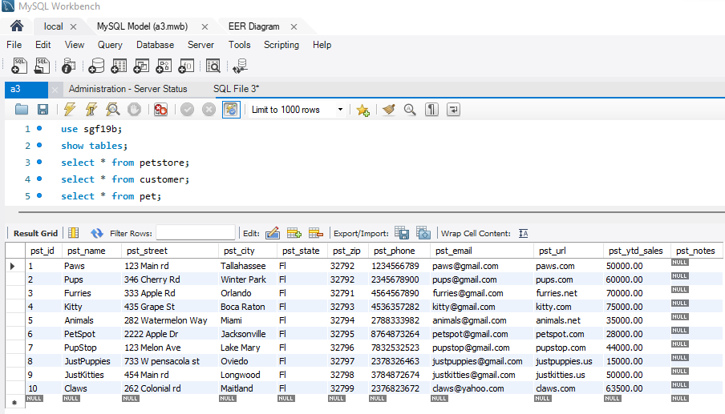
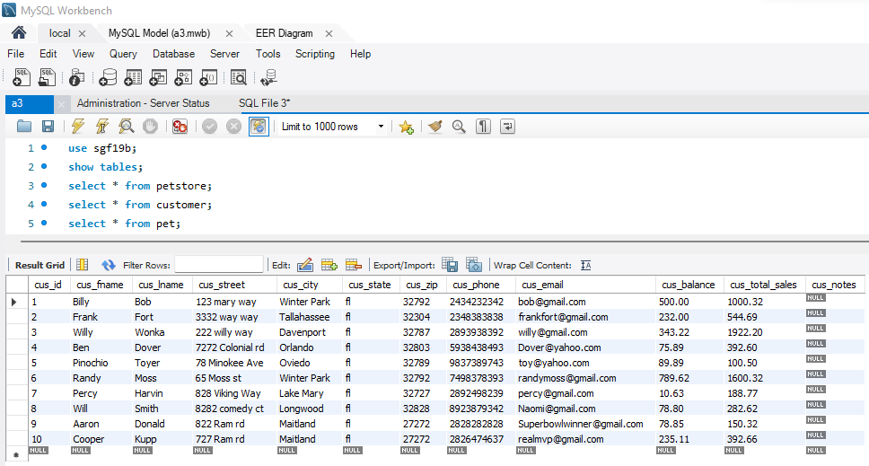
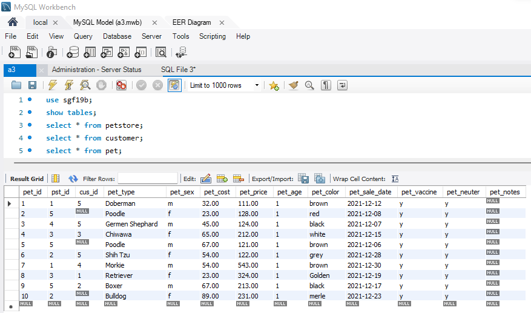
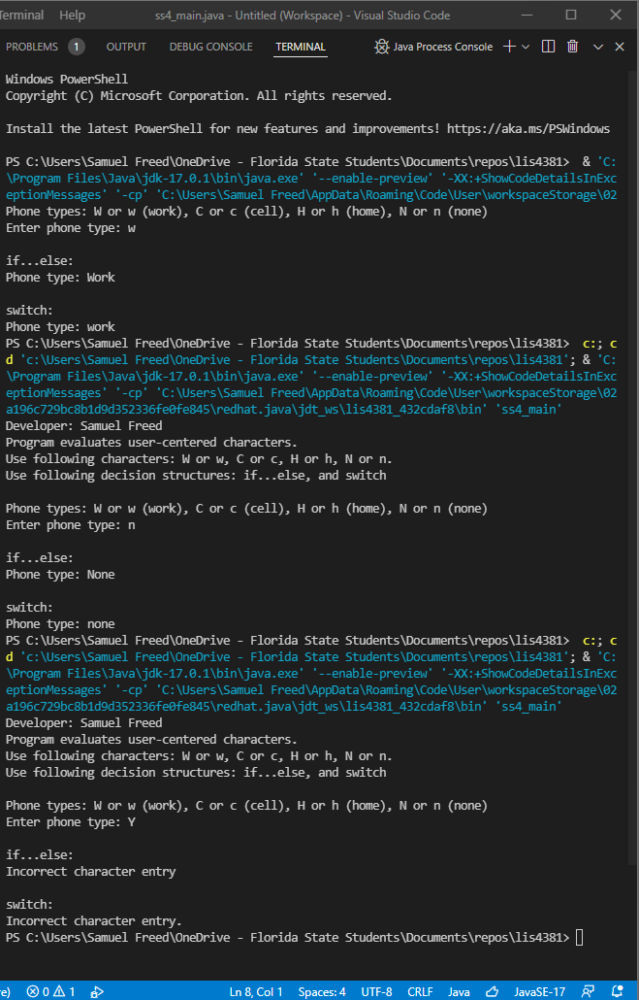
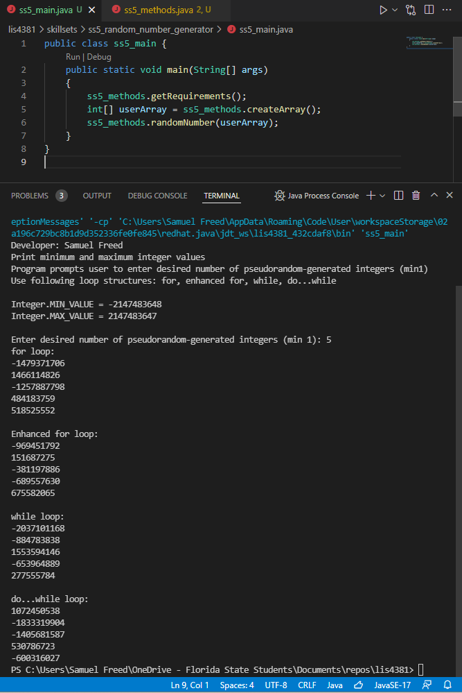
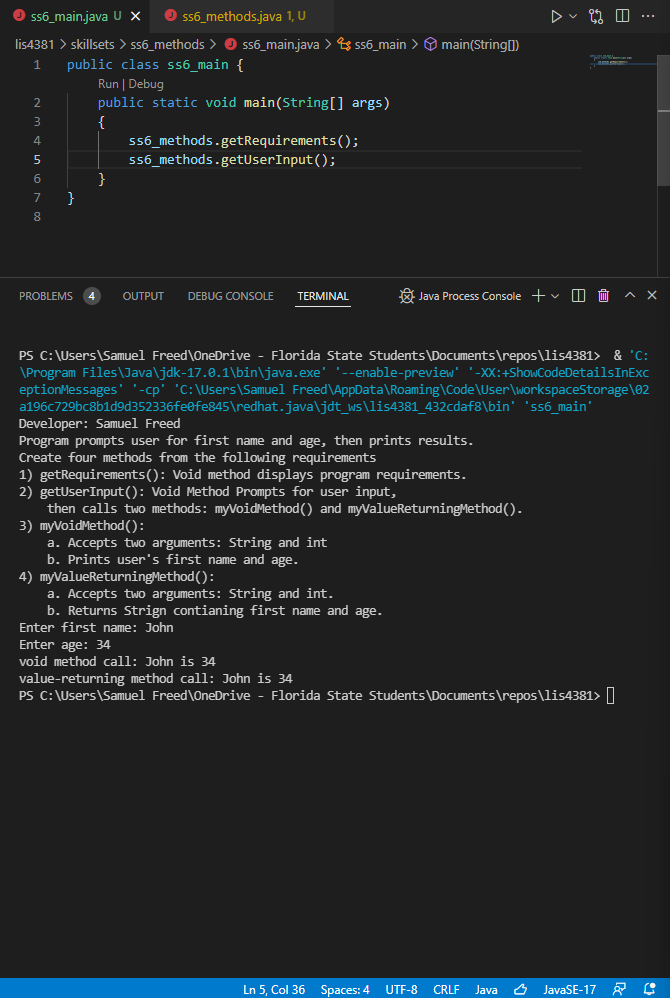

> **NOTE:** This README.md file should be placed at the **root of each of your repos directories.**
>
>Also, this file **must** use Markdown syntax, and provide project documentation as per below--otherwise, points **will** be deducted.
>

# LIS 4381 Mobile Web App Develeopment

## Samuel Freed

### Assignment 3 Requirements:

*Six Parts:*

1. Create Database with ERD
2. Forward Engineer locally with 10 "unique" records per table
3. Provide Screenshots of running application's opeing user interface
4. Provide Screenshots of running application's proccessing user input
5. Provide links of a3.mwb and a3.sql
6. Provide screenshots of SkillSets

#### README.md file should include the following items:

#### Assignment Screenshots:

*Screenshot of ERD:

| Query Result 1 | Query Result 2 | Query Result 3 |
| ----------- | ----------- | ----------- |
|  |  |  |
	
| Opening User Interface | User Input Running |
| ----------- | ----------- |
|  |  |

#### Assignment Links:

*A3 docs: a3.mwb and a3.sql*: 
 
[A3 MWB File](docs/a3.mwb "A3 ERD in .mwb format") 
 
[A3 SQL File](docs/a3.sql "A3 SQL Script") 

#### SkillSet Screenshots:

| SS4 | SS5 | SS6 |
| ----------- | ----------- | ----------- |
||||

#### Tutorial Links:

*Bitbucket Tutorial - Station Locations:*
[A1 Bitbucket Station Locations Tutorial Link](https://bitbucket.org/sgf19b/bitbucketstationlocations/ "Bitbucket Station Locations")

*Tutorial: Request to update a teammate's repository:*
[A1 My Team Quotes Tutorial Link](https://bitbucket.org/sgf19b/myteamquotes/ "My Team Quotes Tutorial")