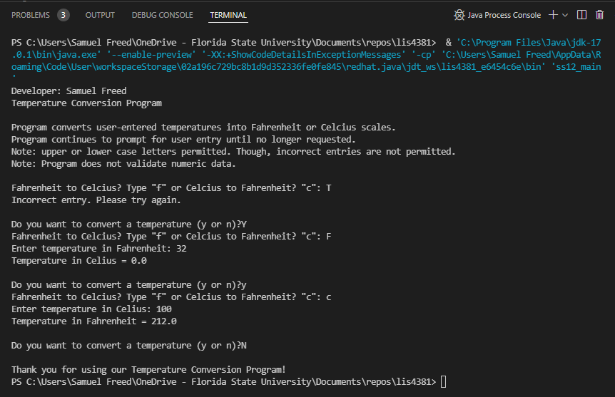

> **NOTE:** This README.md file should be placed at the **root of each of your repos directories.**
>
>Also, this file **must** use Markdown syntax, and provide project documentation as per below--otherwise, points **will** be deducted.
>

# LIS 4381 Mobile Web App Develeopment

## Samuel Freed

### Assignment 4 Requirements:

*Four Parts:*

1. Clone lis4381 student files
2. Provide failed data validation
3. Provide passed data validation
4. Provide Screenshots of SkillSets

#### README.md file should include the following items:

#### Assignment Links:

*Link to local lis4381 webapp*

[A4 LIS4381 local webapp](http://localhost/repos/lis4381/index.php "LIS 4381 Webapp")

### Assignment Screenshots:
|Validation Failed| Validation Passed|
|----|----|
|||

#### SkillSet Screenshots:

| SS10 | SS11 | SS12 |
| ----------- | ----------- | ----------- |
||||

#### Tutorial Links:

*Bitbucket Tutorial - Station Locations:*
[A1 Bitbucket Station Locations Tutorial Link](https://bitbucket.org/sgf19b/bitbucketstationlocations/ "Bitbucket Station Locations")

*Tutorial: Request to update a teammate's repository:*
[A1 My Team Quotes Tutorial Link](https://bitbucket.org/sgf19b/myteamquotes/ "My Team Quotes Tutorial")