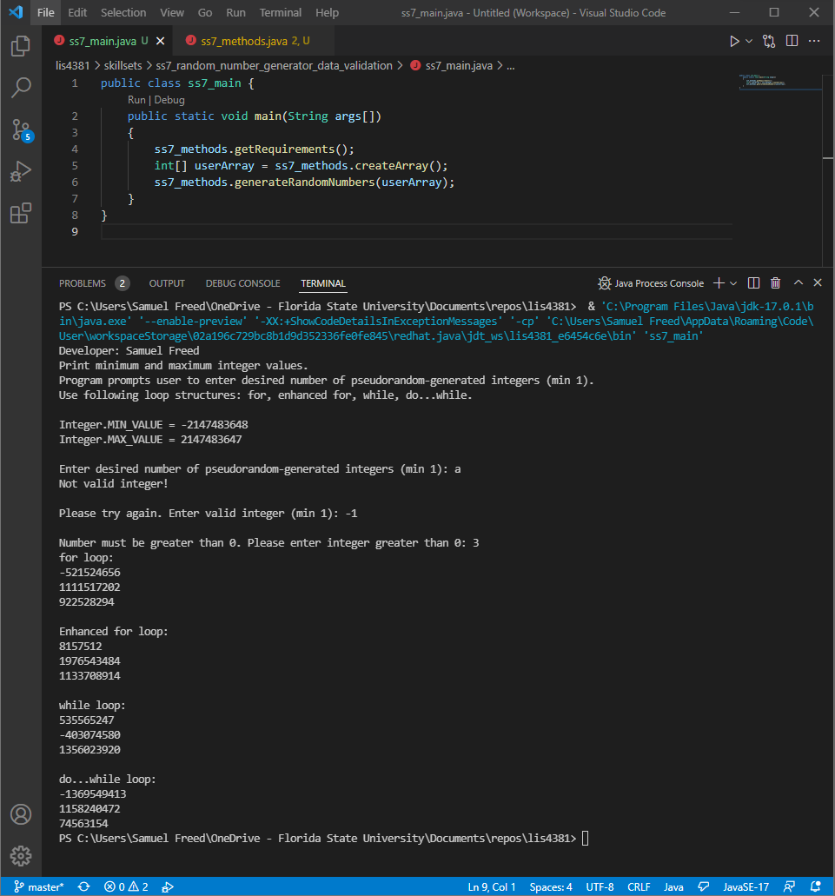
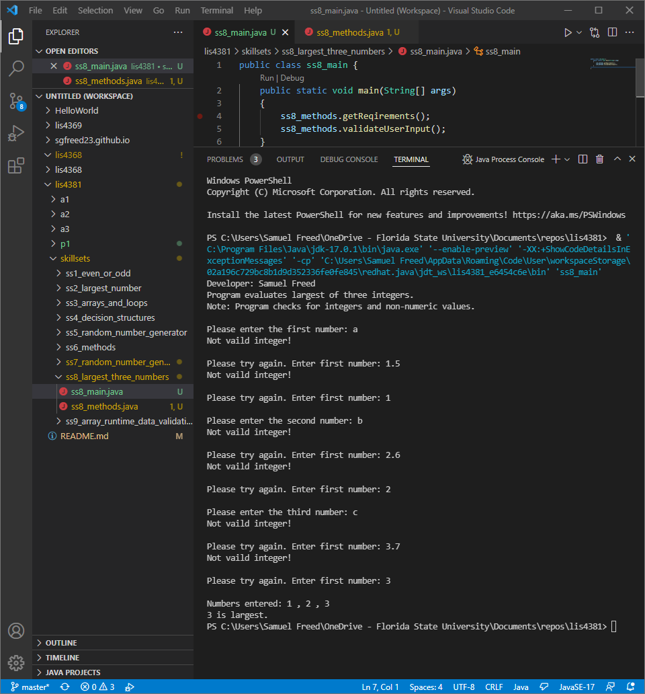
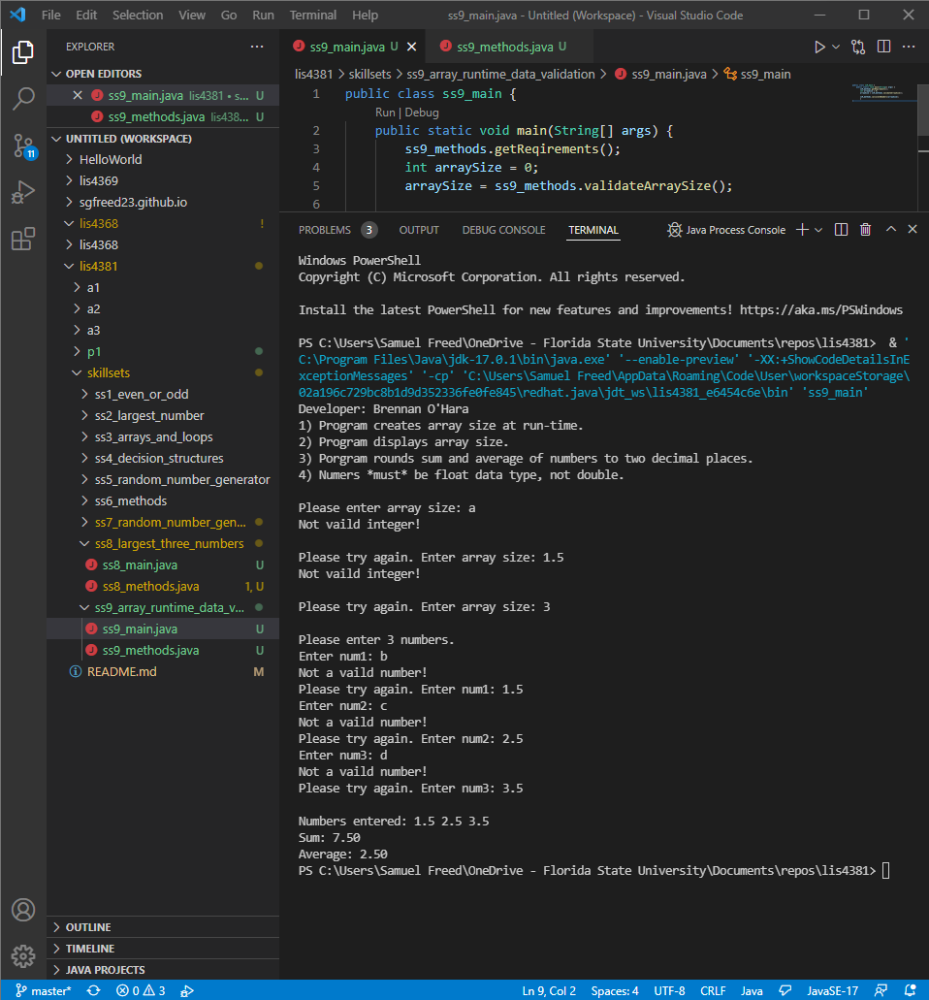

> **NOTE:** This README.md file should be placed at the **root of each of your repos directories.**
>
>Also, this file **must** use Markdown syntax, and provide project documentation as per below--otherwise, points **will** be deducted.
>

# LIS 4381 Mobile Web App Develeopment

## Samuel Freed

### Project 1 Requirements:

*Six Parts:*

1. Backward-engineer the screenshots provided
2. Provide Screenshots of running application's opeing user interface
3. Provide Screenshots of running application's proccessing user input
4. Provide screenshots of SkillSets

#### README.md file should include the following items:

#### Assignment Screenshots:

|Screenshot of First User Interface running|Screenshot of Second User Interface running|
| ----------- | ----------- |
|||
 
#### SkillSet Screenshots:

| SS7 | SS8 | SS9 |
| ----------- | ----------- | ----------- |
||||

#### Tutorial Links:

*Bitbucket Tutorial - Station Locations:*
[A1 Bitbucket Station Locations Tutorial Link](https://bitbucket.org/sgf19b/bitbucketstationlocations/ "Bitbucket Station Locations")

*Tutorial: Request to update a teammate's repository:*
[A1 My Team Quotes Tutorial Link](https://bitbucket.org/sgf19b/myteamquotes/ "My Team Quotes Tutorial")