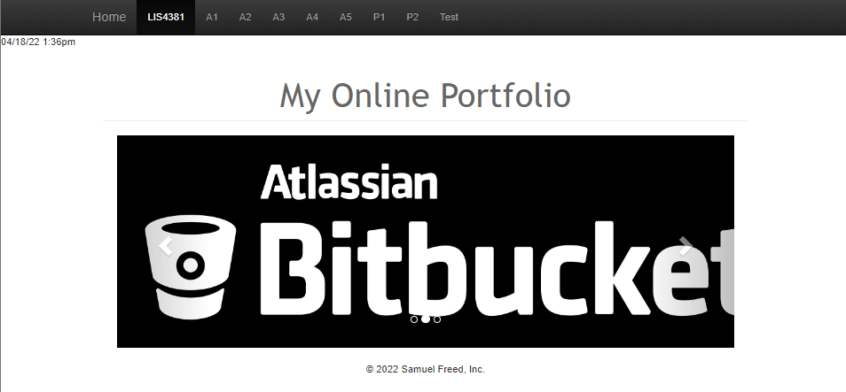
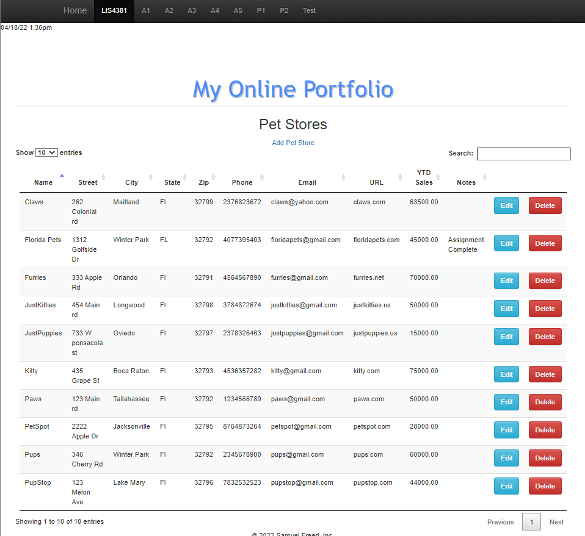
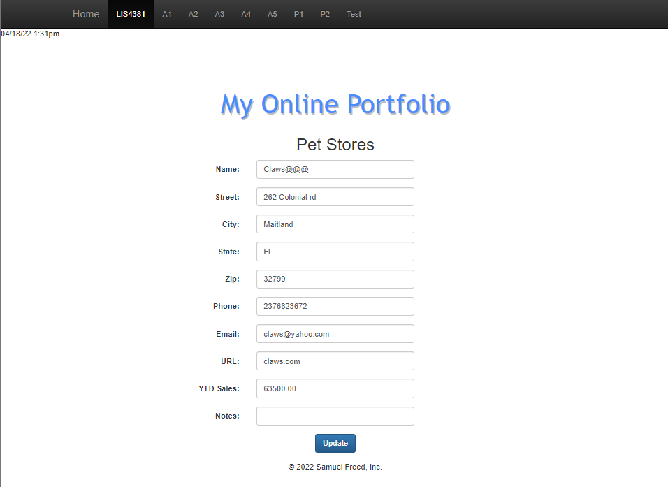
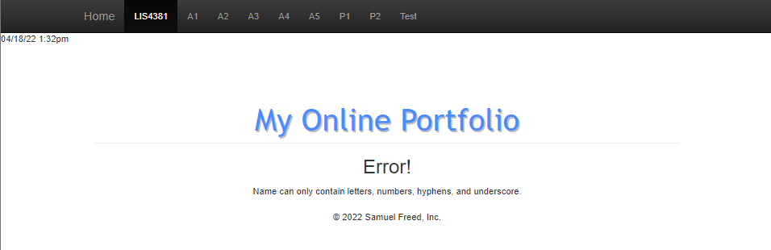
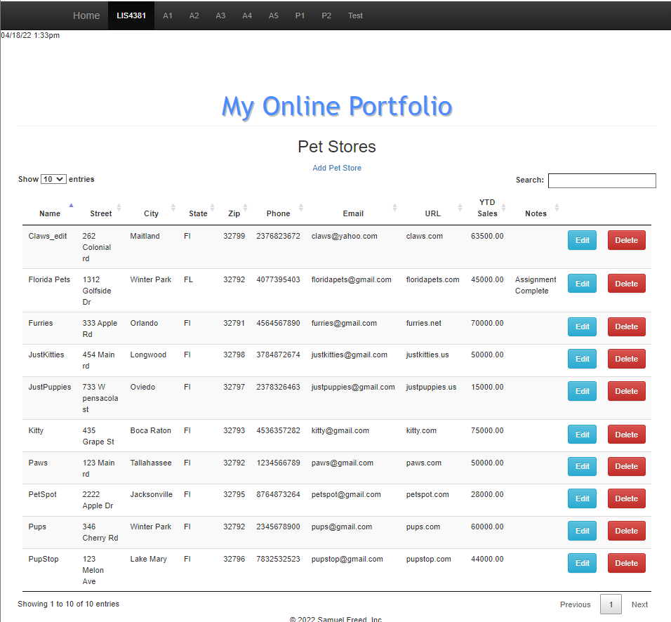
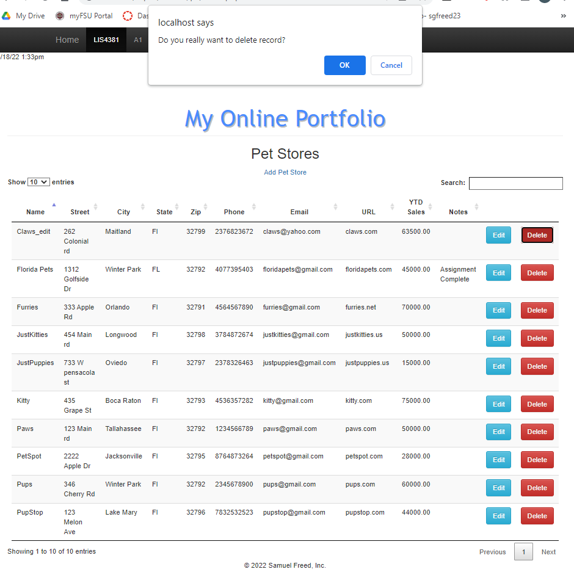
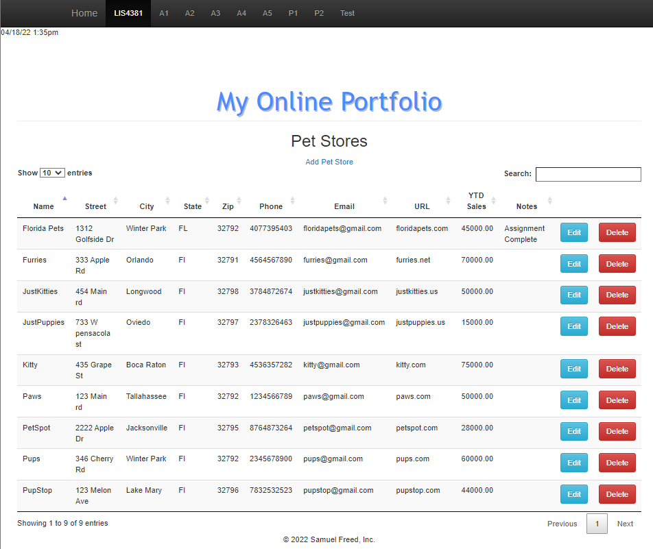
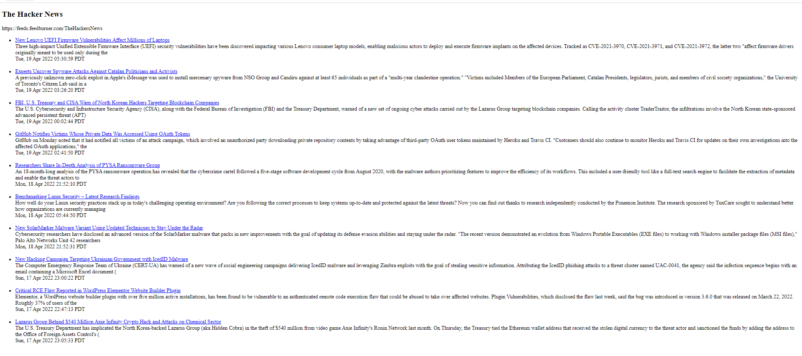

> **NOTE:** This README.md file should be placed at the **root of each of your repos directories.**
>
>Also, this file **must** use Markdown syntax, and provide project documentation as per below--otherwise, points **will** be deducted.
>

# LIS 4381 Mobile Web App Develeopment

## Samuel Freed

### Project 2 Requirements:

*Four Parts:*

1. Modify p2 index.php 
2. Add Server-side validation
3. Provide Screenshots of failed data validation
4. Provide Screenshots of passed data validation

#### README.md file should include the following items:

### Project Screenshots:

*Main Page*

|Before Edit|Edit Before Validation|
|----|----|
|||

|Validation Failed| Validation Passed|
|----|----|
|||

|Delete Record Prompt| Successfully Deleted Prompt|
|----|----|
|||

*RSS Feed*

#### Tutorial Links:

*Bitbucket Tutorial - Station Locations:*
[A1 Bitbucket Station Locations Tutorial Link](https://bitbucket.org/sgf19b/bitbucketstationlocations/ "Bitbucket Station Locations")

*Tutorial: Request to update a teammate's repository:*
[A1 My Team Quotes Tutorial Link](https://bitbucket.org/sgf19b/myteamquotes/ "My Team Quotes Tutorial")