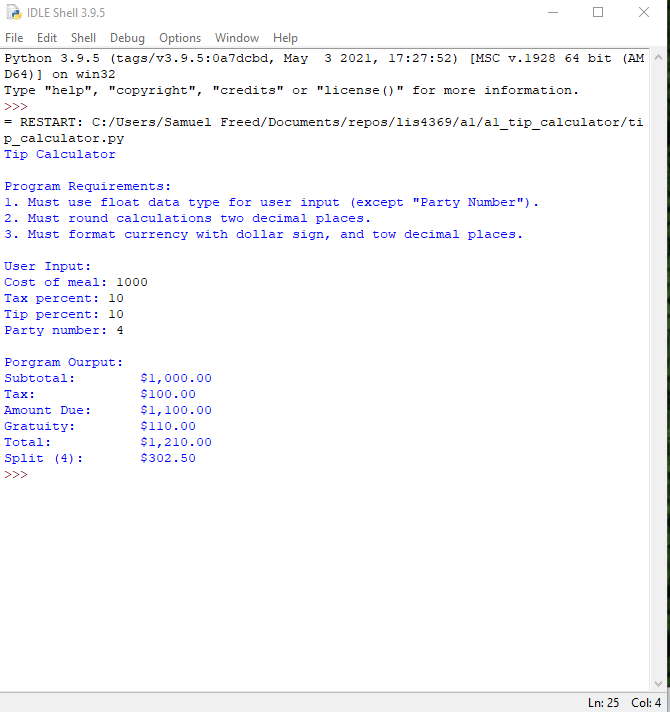
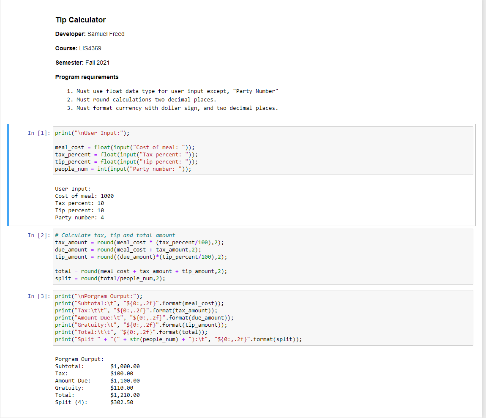

> **NOTE:** This README.md file should be placed at the **root of each of your repos directories.**
>
>Also, this file **must** use Markdown syntax, and provide project documentation as per below--otherwise, points **will** be deducted.
>

# Course LIS4369

## Samuel Freed

### Assignment 1 Requirements:

*Four Parts:*

1. Distributed Version Control with Git and Bitbucket
2. Development Installations
3. Questions
4. Bitbucket Repo Links
    1. this assignment and
    2. the completed tutorial (bitbucketstationlocations)

#### README.md file should include the following items:

* Screenshot of a1_tip_calculator application running
* Link to A1 .ipynb file: [tip_calculator.ipynb](a1_tip_calculator/tip-calculator.ipynb "A1 Jupyter Notebook")
* git commandsm w/short descriptions

> This is a blockquote.
> 
> This is the second paragraph in the blockquote.
>
> #### Git commands w/short descriptions:

1. git init - creates a new git repository
2. git status - displays the state of the working directory and the staging area
3. git add - used to add file content to the staging area
4. git commit - captures a screenshot of the project's currently staged changes
5. git push - used to upload local repository content to a remote repository
6. git pull - used to fetch and download content from a remote repository and immediately update the local repository to match that content
7. git clone - used to traget an existing repository and create a clone or copy of the target repository

#### Assignment Screenshots:

*Screenshot of a1_tip_calculator application running (IDLE)*:

*Screenshot of a1_tip_calculator application running (Visual Studio Code)*:

*Screenshot of *:

#### Tutorial Links:

*Bitbucket Tutorial - Station Locations:*
[A1 Bitbucket Station Locations Tutorial Link](https://bitbucket.org/username/bitbucketstationlocations/ "Bitbucket Station Locations")
