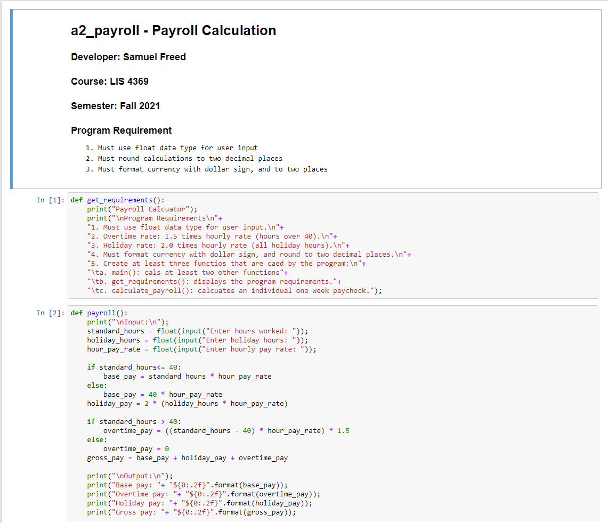
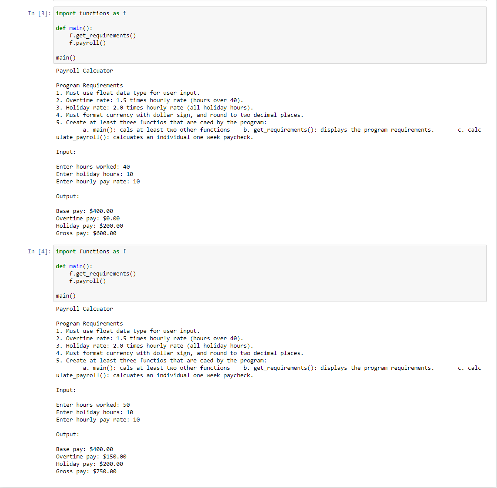
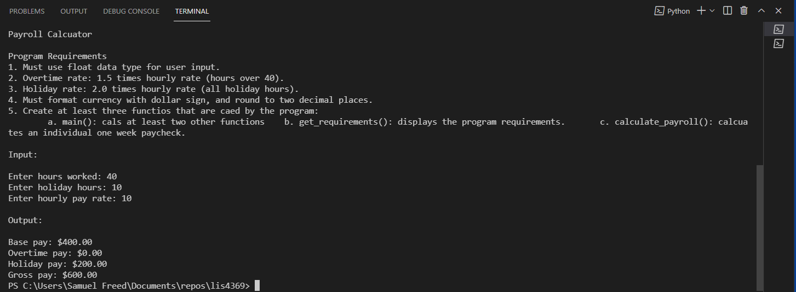
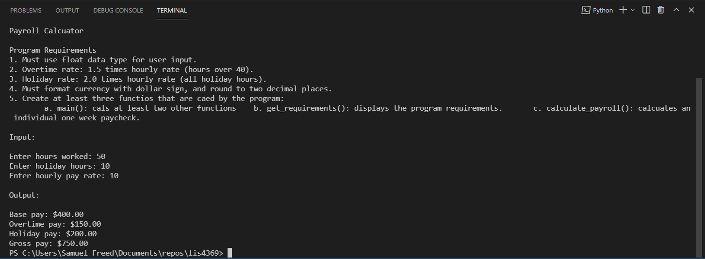
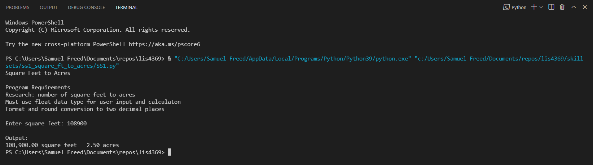
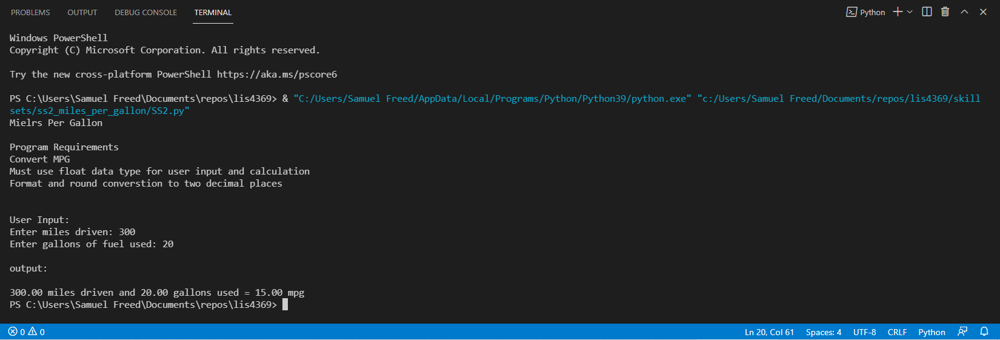
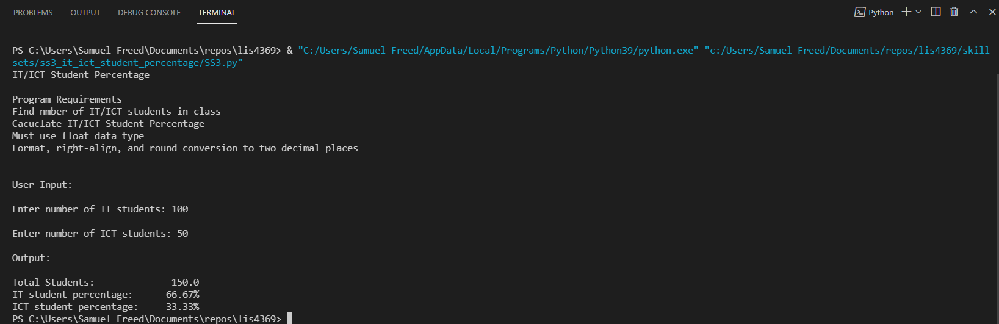

# LIS4369 - Extensible Enterprise Solutions(Python)

## Samuel Freed

### Assignment 2 Requirements:

1. Create at least three functions that are called by the program:
2. main() calls at least two other functions
3. get_requirements(): displays the program requirements
4. calculate_payroll(): calculates an individual one-week paycheck
5. skillsets 1-3

#### README.md file should include the following items:

* Assignment Requirements
* Screenshots of a2_payroll application running
* Screenshots of a2_payroll Jupytor Notebook
* Screenshots of a2 skill sets

> This is a blockquote.
> 
> This is the second paragraph in the blockquote.

#### Assignment Screenshots:

*Screenshot of a2_payroll Jupytor Notebook *:

*Screenshot of a2_payroll(no overtime)*:

*Screenshot of a2_payroll(with overtime)*:

*Screenshots of Skill Sets*
*Skill Set 1*

*Skill Set 2*

*Skill Set 3*

