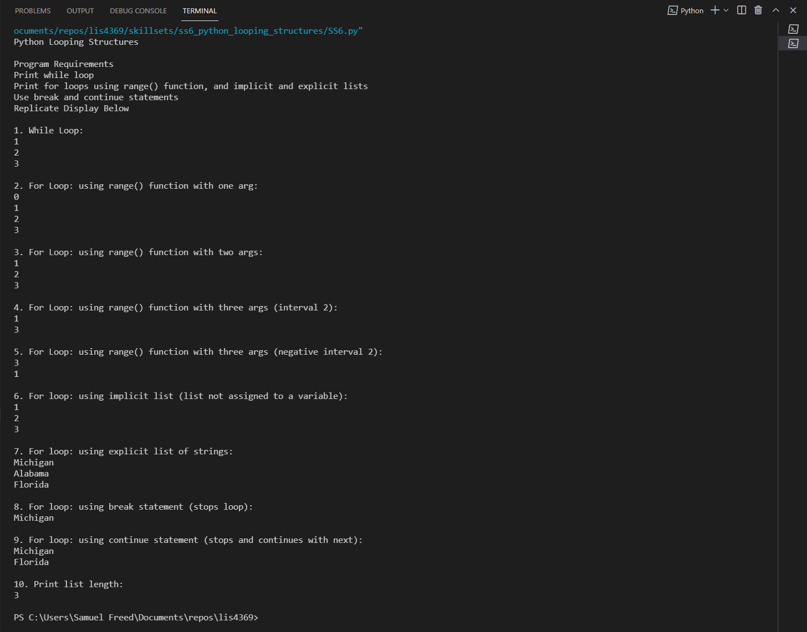

# LIS4369 - Extensible Enterprise Solutions(Python)

## Samuel Freed

### Assignment 3 Requirements:

1. Backward Engineer (using Python) 
2. Program should be organized with two modules
3. Test your program with both IDLE and VIsual Studio Code
4. Upload all screenshots
5. Upload jupytor notebook
6. skillsets 4-6

#### README.md file should include the following items:

* Assignment Requirements
* Screenshots of a3_painting_estimator application running
* Screenshots of a3_painting_estimator Jupytor Notebook
* Screenshots of a3 skill sets

> This is a blockquote.
> 
> This is the second paragraph in the blockquote.

#### Assignment Screenshots:

*Screenshot of a3_painting_estimator Jupytor Notebook *:

*Screenshot of a3_painting_estimator*:

*Screenshots of Skill Sets*

*Skill Set 4*

*Skill Set 5*

*Skill Set 6*

