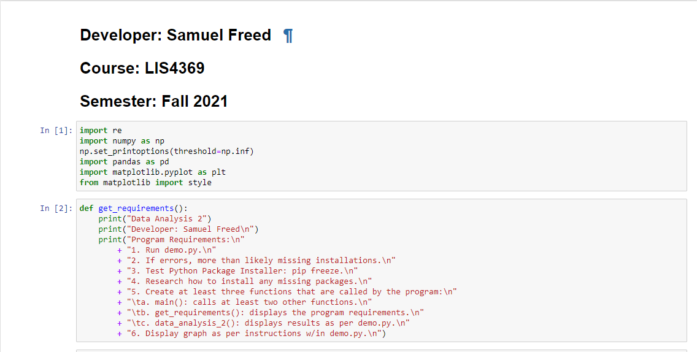
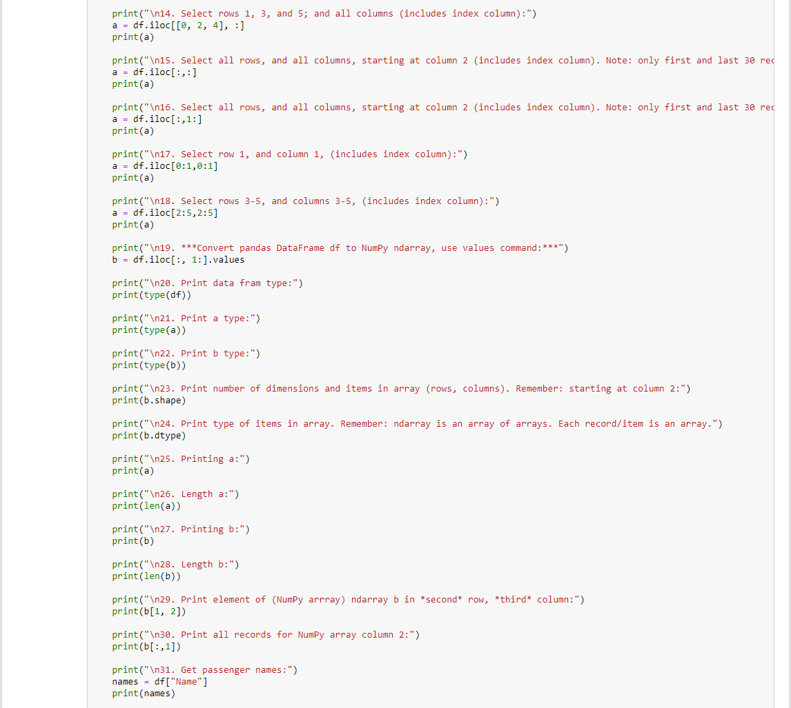

# LIS4369 - Extensible Enterprise Solutions(Python)

## Samuel Freed

### Assignment 4 Requirements:

1. Backward Engineer (using Python) 
2. Test your program with both IDLE and VIsual Studio Code
3. Upload all screenshots
4. Upload jupytor notebook
5. skillsets 10-12

#### README.md file should include the following items:

* Assignment Requirements
* Screenshots of a4_demo application running
* Screenshots of a4_demo Jupytor Notebook
* Screenshots of a4 skill sets

> This is a blockquote.
> 
> This is the second paragraph in the blockquote.

#### Assignment Screenshots:

*Screenshot of a4_demo Jupytor Notebook *:

*Screenshot of a4_demo*:

*Screenshots of Skill Sets*

*Skill Set 10*

*Skill Set 11*

*Skill Set 12*

