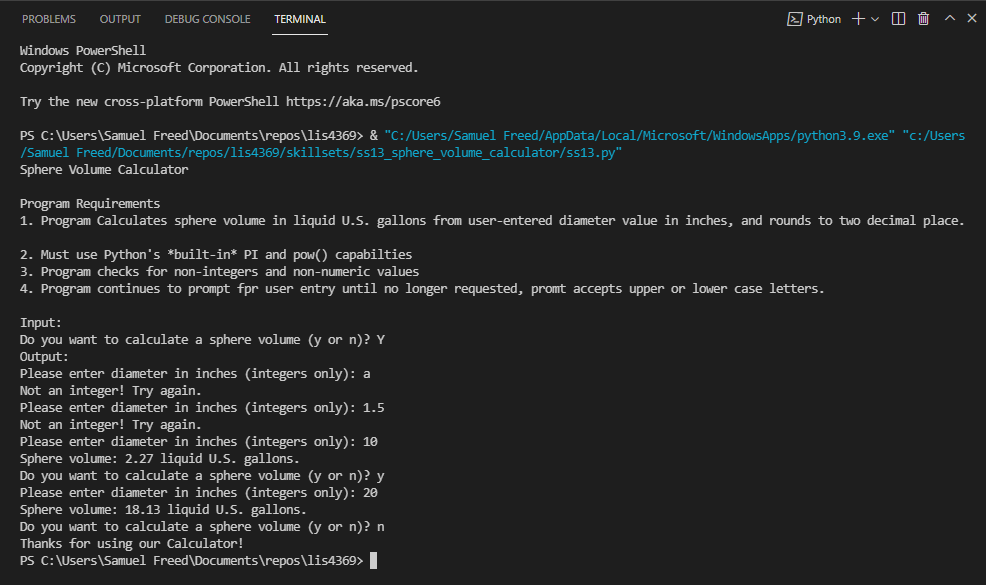

# LIS4369 - Extensible Enterprise Solutions(Python)

## Samuel Freed

### Assignment 5 Requirements:

    1. Setup and Install R Studio
	2. Complete Introduction_to_R_Setup_and_Tutorial
    3. Combine demo1.R and demo2.R into lis4369_a5.R 
    4. Provide Screenshots of Development
    5. Skill Sets 13-15

#### README.md file should include the following items:

* Assignment Requirements
* Screenshots of a5_tutorial
* Screenshots of a5_demo
* Screenshots of a5 skill sets

> This is a blockquote.
> 
> This is the second paragraph in the blockquote.

#### Assignment Screenshots:

*Screenshot of Introduction to R Setup and Tutorial *:

*Screenshot of lis4369_a5*:

*Screenshots of Skill Sets*

*Skill Set 13*

*Skill Set 14*

*Skill Set 15*

