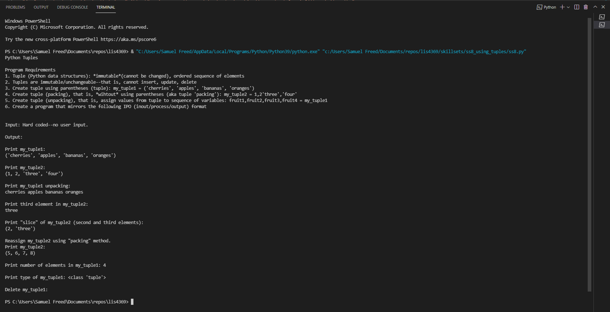

# LIS4369 - Extensible Enterprise Solutions(Python)

## Samuel Freed

### Project 1 Requirements:

1. Backward Engineer (using Python) 
2. Code and Run demo.py
3. Test your program with both IDLE and VIsual Studio Code
4. Upload all screenshots
5. Upload jupytor notebook
6. skillsets 7-9

#### README.md file should include the following items:

* Assignment Requirements
* Screenshots of p1 application running
* Screenshots of p1 Jupytor Notebook
* Screenshots of p1 skill sets

> This is a blockquote.
> 
> This is the second paragraph in the blockquote.

#### Project Screenshots:

*Screenshot of p1_demo Jupytor Notebook *:

*Screenshot of p1_demo*:

*Screenshots of Skill Sets*

*Skill Set 7*

*Skill Set 8*

*Skill Set 9*

